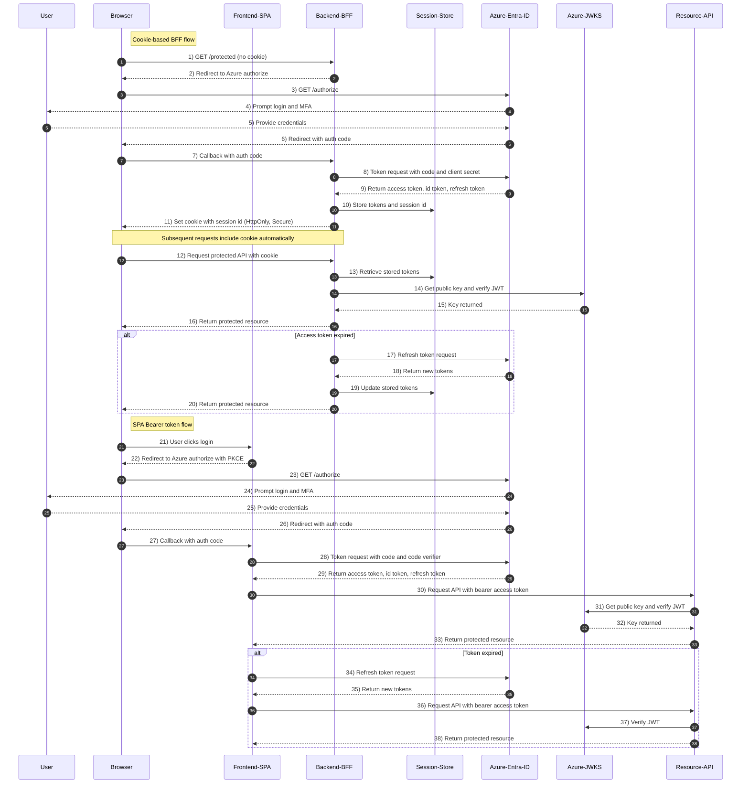

# End-to-End OAuth2 Authorization Code Flow with PKCE, MFA, Cookies (BFF Pattern) and Bearer Tokens (SPA Pattern) Using Azure Entra ID

- **<mark>Step 1</mark>**: Browser requests a **protected page/resource**.
   
- **<mark>Step 2</mark>**: Backend detects **no valid session cookie** → issues an **OAuth2 Authorization Request** (redirect to Azure /authorize). Important params:
    - `response_type`=code,
    - `client_id`,
    - `redirect_uri`,
    - `scope`=openid profile offline_access <api-scope>,
    - `state`,
    - `nonce`,
    - (for SPA add `code_challenge`/`PKCE`).

- **<mark>Step 3 to 5</mark>**: User authenticates at Azure Entra ID: username/password → MFA step (phone, push, TOTP, FIDO, etc.) as required by **tenant Conditional Access**. Azure then redirects back with an **authorization code**.

- **<mark>Step 6 to 8</mark>**: Token exchange (Backend/BFF): Backend exchanges code at Azure token endpoint with client_secret (confidential client) for access_token (JWT), id_token (JWT), and refresh_token (long, opaque string). Azure signs JWTs with RS256 and publishes keys via JWKS.

- **<mark>Step 9 to 10</mark>**: Backend stores tokens server-side (Session Store) and issues a HttpOnly Secure cookie to the browser: session_id=SESS123; HttpOnly; Secure; SameSite=Strict. Browser cannot read this cookie via JS (protects against XSS); cookie is auto-sent on future requests.

- **<mark>Step 11 to 16</mark>**: On each protected API request the backend reads session_id, pulls tokens from Session Store, validates the JWT (signature → get key from JWKS, then check iss, aud, exp, nbf, required scp/roles). If access token is valid, respond.

- **<mark>Step 17 to 19</mark>**: If the access token is expired, the backend uses the stored refresh_token to get a fresh access_token (token rotation usually returns a new refresh token). Update Session Store.

- **<mark>Step 21 to 26</mark>**: Logout: Backend removes session, optionally calls Azure revocation endpoint to revoke refresh_token, clears cookie, and may redirect user to Azure logout endpoint to clear SSO session.

- **<mark>Step 27 to 36</mark>**: SPA (Bearer) flow: SPA initiates the same /authorize redirect but includes PKCE (code_challenge). After Azure login + MFA, SPA receives a code, then directly POSTs to /token with code_verifier (no client_secret for public clients). Azure returns access_token (JWT), id_token, maybe refresh_token depending on configuration. SPA stores access token in memory (recommended). For API calls it sends Authorization: Bearer <access_token>.

- **<mark>Step 37 to 43</mark>**: Resource server verifies the JWT by fetching the JWKS (cache keys), validating the signature and claims. If expired, SPA uses refresh_token to obtain a new access token or reauthenticates.

