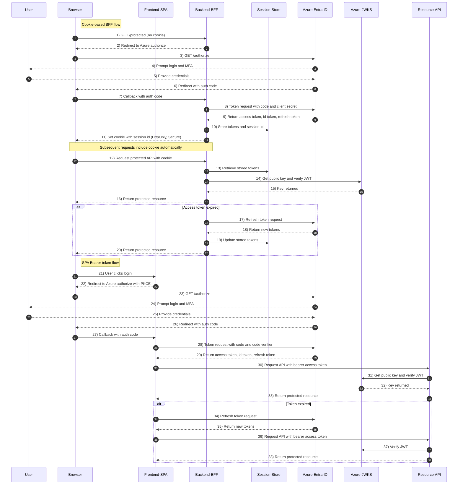

# End-to-End OAuth2 Authorization Code Flow with PKCE, MFA, Cookies (BFF Pattern) and Bearer Tokens (SPA Pattern) Using Azure Entra ID

## Concepts
- `Tokens` vs. `Cookie` vs. `Sessions`
- **Cookie**: `HttpOnly` vs. `Secure` vs. `SameSite`
- **Cookie-based** vs. **Bearer Token-based**

## Flow



- **<mark>Step 1</mark>**: Browser requests a **protected page/resource**.
   
- **<mark>Step 2</mark>**: Backend detects **no valid session cookie** → issues an **OAuth2 Authorization Request** (redirect to Azure /authorize). Important params:
    - `response_type`=code,
    - `client_id`,
    - `redirect_uri`,
    - `scope`=openid profile offline_access <api-scope>,
    - `state`,
    - `nonce`,
    - (for SPA add `code_challenge`/`PKCE`).

- **<mark>Step 3 to 5</mark>**: User authenticates at Azure Entra ID: username/password → MFA step (phone, push, TOTP, FIDO, etc.) as required by **tenant Conditional Access**. Azure then redirects back with an **authorization code**.

- **<mark>Step 6 to 8</mark>**: Token exchange (Backend/BFF): Backend exchanges code at Azure token endpoint with `client_secret` (confidential client) for `access_token` (JWT), `id_token` (JWT), and `refresh_token` (long, opaque string). Azure signs `JWTs` with RS256 and publishes keys via `JWKS`.

- **<mark>Step 9 to 10</mark>**: Backend stores tokens server-side (Session Store) and issues a **`HttpOnly Secure` cookie** to the browser: `session_id=SESS123; HttpOnly; Secure; SameSite=Strict`. Browser cannot read this cookie via JS (protects against XSS); cookie is `auto-sent` on future requests.

- **<mark>Step 11 to 16</mark>**: On each protected API request the backend reads `session_id`, pulls tokens from `Session Store`, validates the JWT (signature → get key from JWKS, then check `iss`, `aud`, `exp`, `nbf`, required `scp/roles`). If access token is valid, respond.

- **<mark>Step 17 to 19</mark>**: If the access token is expired, the backend uses the stored `refresh_token` to get a fresh `access_token` (token rotation usually returns a new refresh token). Update Session Store.

- **<mark>Step 21 to 26</mark>**: **Logout**: Backend removes session, optionally calls Azure revocation endpoint to revoke `refresh_token`, **clears cookie**, and may redirect user to **Azure logout endpoint** to clear **SSO session**.

- **<mark>Step 27 to 36</mark>**: **SPA (Bearer) flow**: SPA initiates the **same /authorize redirect but includes PKCE** (`code_challenge`). After Azure login + MFA, SPA receives a code, then directly POSTs to `/token` with `code_verifier` (no `client_secret` for public clients). Azure returns `access_token` (JWT), `id_token`, maybe `refresh_token` depending on configuration. SPA stores access token in memory (recommended). For API calls it sends Authorization: `Bearer <access_token>`.

- **<mark>Step 37 to 43</mark>**: Resource server verifies the JWT by fetching the `JWKS` (cache keys), validating the signature and claims. If expired, SPA uses `refresh_token` to obtain a new access token or reauthenticates.


## Security recommendations & small checklist
- Prefer BFF (cookie + HttpOnly cookie) pattern for SPAs when you control a backend — best balance: tokens never touch JS, backend handles refresh.
- If doing pure SPA: use Authorization Code + PKCE; store access token in memory (not localStorage). Carefully handle refresh tokens (rotation, use refresh via backend if possible).
- Use SameSite=strict/lax and CSRF protection on cookie endpoints.
- Cache JWKS but refresh according to kid mismatch or expiry. Validate iss, aud, exp, nbf, iat, optionally azp or scp.
- Log & monitor refresh failures (token theft indicators). Enforce Conditional Access & MFA in Azure (MFA shows in amr claim).
- Consider token lifetimes: short `access_token` and refresh token rotation for better security.


## Cookie vs Bearer Flow

Think of it like **two ways of carrying your building pass**:
- **Cookie-based**: You store your pass inside a sealed pouch (HttpOnly cookie) that automatically gets handed to the guard whenever you visit the building. You never directly touch the pass; the browser takes care of it.
- **Bearer-token-based**: You keep the pass in your hand and present it manually at every door (via Authorization header).

- **Cookie-based** = You hand the pouch to your assistant (browser), they pass it to security automatically, you never touch the actual badge.
- **Bearer token** = You keep the badge in your own hand and flash it to every guard yourself.

| Feature            | Cookie-based                                                   | Bearer Token-based                                              |
| ------------------ | -------------------------------------------------------------- | --------------------------------------------------------------- |
| **Storage**        | Session ID in HttpOnly cookie (backend stores tokens)          | JWT stored client-side (memory/localStorage)                    |
| **Security**       | Stronger against XSS (HttpOnly cookies)                        | Vulnerable if JS-accessible storage is compromised              |
| **CSRF Risk**      | Needs CSRF protection (cookies auto-send)                      | Immune to CSRF (explicit header)                                |
| **Statelessness**  | Usually stateful (backend session store)                       | Stateless (JWT validated without DB)                            |
| **Token Rotation** | Managed by backend                                             | Managed by frontend                                             |
| **Ideal For**      | Sensitive apps where you want to shield tokens from browser JS | APIs for SPAs/mobile apps where backend is not storing sessions |

```mermaid
flowchart TB
    subgraph CookieFlow["Cookie-Based OAuth2 Flow"]
        A1[Browser visits /protected] --> A2[Backend checks session cookie]
        A2 -->|No cookie| A3[Redirect to Azure Entra ID login]
        A3 --> A4[Azure login + MFA]
        A4 --> A5[Redirect back to backend with auth code]
        A5 --> A6[Backend exchanges code for Access + ID + Refresh Tokens]
        A6 --> A7[Backend stores tokens in server session store]
        A7 --> A8[Backend sets HttpOnly Secure Cookie with session ID]
        A8 --> A9[Browser automatically sends cookie on every request]
        A9 --> A10[Backend retrieves tokens from session and verifies JWT]
        A10 --> A11[Serve protected resource]
    end

    subgraph BearerFlow["Bearer Token OAuth2 Flow"]
        B1[Browser visits /protected] --> B2[Backend says: Need Authorization]
        B2 --> B3[Browser redirects user to Azure login]
        B3 --> B4[Azure login + MFA]
        B4 --> B5[Redirect back to frontend with auth code]
        B5 --> B6[Frontend exchanges code (PKCE) directly with Azure for tokens]
        B6 --> B7[Frontend stores Access Token in memory/localStorage]
        B7 --> B8[Frontend sends token in Authorization header: Bearer <token>]
        B8 --> B9[Backend verifies JWT signature + claims]
        B9 --> B10[Serve protected resource]
    end
```
