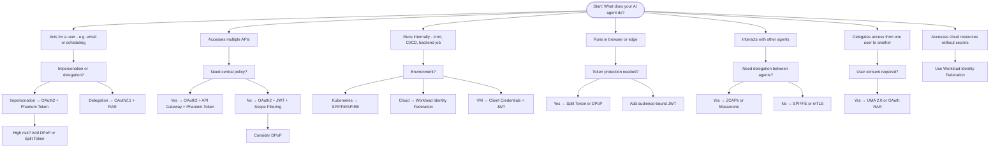

# Secure-Agentic-Workflow
Notes on how to secure Agentic Workflows

```mermaid
graph TD
    Start([Start: What does your AI agent do?])

    Start --> A1[Acts for a user - e.g. email or scheduling]
    Start --> A2[Accesses multiple APIs]
    Start --> A3[Runs internally - cron, CI/CD, backend job]
    Start --> A4[Runs in browser or edge]
    Start --> A5[Interacts with other agents]
    Start --> A6[Delegates access from one user to another]
    Start --> A7[Accesses cloud resources without secrets]

    A1 --> B1[Impersonation or delegation?]
    B1 --> C1[Impersonation → OAuth2 + Phantom Token]
    B1 --> C2[Delegation → OAuth2.1 + RAR]
    C1 --> C1a[High risk? Add DPoP or Split Token]

    A2 --> B2[Need central policy?]
    B2 --> D1[Yes → OAuth2 + API Gateway + Phantom Token]
    B2 --> D2[No → OAuth2 + JWT + Scope Filtering]
    D2 --> D2a[Consider DPoP]

    A3 --> E1[Environment?]
    E1 --> F1[Kubernetes → SPIFFE/SPIRE]
    E1 --> F2[Cloud → Workload Identity Federation]
    E1 --> F3[VM → Client Credentials + JWT]

    A4 --> G1[Token protection needed?]
    G1 --> H1[Yes → Split Token or DPoP]
    G1 --> H2[Add audience-bound JWT]

    A5 --> I1[Need delegation between agents?]
    I1 --> J1[Yes → ZCAPs or Macaroons]
    I1 --> J2[No → SPIFFE or mTLS]

    A6 --> K1[User consent required?]
    K1 --> L1[Yes → UMA 2.0 or OAuth RAR]

    A7 --> M1[Use Workload Identity Federation]
```
