# Secure-Agentic-Workflow
Notes on how to secure Agentic Workflows

```mermaid
graph TD
    Start([Start])

    %% Layer 1: Who does the agent serve?
    Start --> ServeUser[Serves a user]
    Start --> ServeOrg[Serves the organization / itself]
    Start --> ServeAgents[Serves other agents / multi-agent collaboration]
    Start --> ServeCrossUser[Delegates between users]

    %% Layer 2: Where does it run?
    ServeUser --> UserEnv1[Runs in browser or edge]
    ServeUser --> UserEnv2[Runs on backend / cloud / internal]
    ServeOrg --> OrgEnv1[Kubernetes / microservice infra]
    ServeOrg --> OrgEnv2[Cloud VM / serverless]
    ServeOrg --> OrgEnv3[Edge or public-facing]
    ServeAgents --> AgentEnv1[Internal agent network]
    ServeAgents --> AgentEnv2[Cross-domain or federated]
    ServeCrossUser --> CrossEnv1[User-to-user sharing with consent]

    %% Layer 3: Risk level
    UserEnv1 --> RiskU1[Risk level? Low / Medium / High]
    UserEnv2 --> RiskU2[Risk level? Low / Medium / High]
    OrgEnv1 --> RiskO1[Risk level? Low / Medium / High]
    OrgEnv2 --> RiskO2[Risk level? Low / Medium / High]
    OrgEnv3 --> RiskO3[Risk level? Low / Medium / High]
    AgentEnv1 --> RiskA1[Risk level? Low / Medium / High]
    AgentEnv2 --> RiskA2[Risk level? Low / Medium / High]
    CrossEnv1 --> RiskC1[Risk level? Low / Medium / High]

    %% Decisions: Serve a user paths
    RiskU1 --> U1Low[Low risk → OAuth2 + JWT with narrow scopes]
    RiskU1 --> U1Med[Medium risk → OAuth2 + Phantom Token + API Gateway]
    RiskU1 --> U1High[High risk → OAuth2.1 / RAR + DPoP or Split Token + short-lived tokens]

    RiskU2 --> U2Low[Low risk → OAuth2 client credentials or delegated token]
    RiskU2 --> U2Med[Medium risk → OAuth2 + Phantom Token + introspection]
    RiskU2 --> U2High[High risk → OAuth2.1 RAR + DPoP + audit logging]

    %% Organization/self agent paths
    RiskO1 --> O1Low[Low risk → SPIFFE identity + mTLS]
    RiskO1 --> O1Med[Medium risk → SPIFFE + short-lived certificates + audit]
    RiskO1 --> O1High[High risk → SPIFFE + ZCAPs for delegation + strict policy enforcement]

    RiskO2 --> O2Low[Low risk → Workload Identity Federation]
    RiskO2 --> O2Med[Medium risk → Workload Identity + scoped short creds]
    RiskO2 --> O2High[High risk → Workload Identity + DPoP-like binding + monitoring]

    RiskO3 --> O3Low[Low risk → Split Token]
    RiskO3 --> O3Med[Medium risk → Split Token + audience-bound JWT]
    RiskO3 --> O3High[High risk → Split Token + DPoP + token replay protection]

    %% Multi-agent collaboration
    RiskA1 --> A1Low[Low risk → SPIFFE for mutual auth]
    RiskA1 --> A1Med[Medium risk → SPIFFE + Macaroons for scoped delegation]
    RiskA1 --> A1High[High risk → SPIFFE + ZCAPs chain + audit + revocation]

    RiskA2 --> A2Low[Low risk → Federated capability exchange]
    RiskA2 --> A2Med[Medium risk → DID-backed ZCAPs or Macaroons]
    RiskA2 --> A2High[High risk → Cross-domain ZCAPs + proof-of-possession + verification chains]

    %% Delegation between users
    RiskC1 --> C1Low[Low risk → UMA 2.0 light delegation]
    RiskC1 --> C1Med[Medium risk → OAuth RAR with consent logging]
    RiskC1 --> C1High[High risk → UMA 2.0 + RAR + audit trail + time limits]

    %% Fallback / enhancements (common augmentations)
    U1High --> Enhance1[Add revocation endpoint, session binding, logging]
    U2High --> Enhance2[Add anomaly detection, user re-consent]
    O1High --> Enhance3[Policy engine + dynamic authorization]
    A1High --> Enhance4[Delegation expiration, capability revocation]
```

## Primary Decision Paths

| Who Agent Serves | Runtime Environment | Risk Level | Authentication/Authorization Solution | Enhancements |
|------------------|-------------------|------------|-------------------------------------|--------------|
| **Serves a user** | Runs in browser or edge | Low | OAuth2 + JWT with narrow scopes | - |
| **Serves a user** | Runs in browser or edge | Medium | OAuth2 + Phantom Token + API Gateway | - |
| **Serves a user** | Runs in browser or edge | High | OAuth2.1 / RAR + DPoP or Split Token + short-lived tokens | Add revocation endpoint, session binding, logging |
| **Serves a user** | Runs on backend / cloud / internal | Low | OAuth2 client credentials or delegated token | - |
| **Serves a user** | Runs on backend / cloud / internal | Medium | OAuth2 + Phantom Token + introspection | - |
| **Serves a user** | Runs on backend / cloud / internal | High | OAuth2.1 RAR + DPoP + audit logging | Add anomaly detection, user re-consent |
| **Serves the organization / itself** | Kubernetes / microservice infra | Low | SPIFFE identity + mTLS | - |
| **Serves the organization / itself** | Kubernetes / microservice infra | Medium | SPIFFE + short-lived certificates + audit | - |
| **Serves the organization / itself** | Kubernetes / microservice infra | High | SPIFFE + ZCAPs for delegation + strict policy enforcement | Policy engine + dynamic authorization |
| **Serves the organization / itself** | Cloud VM / serverless | Low | Workload Identity Federation | - |
| **Serves the organization / itself** | Cloud VM / serverless | Medium | Workload Identity + scoped short creds | - |
| **Serves the organization / itself** | Cloud VM / serverless | High | Workload Identity + DPoP-like binding + monitoring | - |
| **Serves the organization / itself** | Edge or public-facing | Low | Split Token | - |
| **Serves the organization / itself** | Edge or public-facing | Medium | Split Token + audience-bound JWT | - |
| **Serves the organization / itself** | Edge or public-facing | High | Split Token + DPoP + token replay protection | - |
| **Serves other agents / multi-agent collaboration** | Internal agent network | Low | SPIFFE for mutual auth | - |
| **Serves other agents / multi-agent collaboration** | Internal agent network | Medium | SPIFFE + Macaroons for scoped delegation | - |
| **Serves other agents / multi-agent collaboration** | Internal agent network | High | SPIFFE + ZCAPs chain + audit + revocation | Delegation expiration, capability revocation |
| **Serves other agents / multi-agent collaboration** | Cross-domain or federated | Low | Federated capability exchange | - |
| **Serves other agents / multi-agent collaboration** | Cross-domain or federated | Medium | DID-backed ZCAPs or Macaroons | - |
| **Serves other agents / multi-agent collaboration** | Cross-domain or federated | High | Cross-domain ZCAPs + proof-of-possession + verification chains | - |
| **Delegates between users** | User-to-user sharing with consent | Low | UMA 2.0 light delegation | - |
| **Delegates between users** | User-to-user sharing with consent | Medium | OAuth RAR with consent logging | - |
| **Delegates between users** | User-to-user sharing with consent | High | UMA 2.0 + RAR + audit trail + time limits | - |

## Decision Tree Structure

### Layer 1: Primary Service Model
- **Serves a user**: Agent acts on behalf of individual users
- **Serves the organization / itself**: Agent operates for organizational needs or autonomous operations
- **Serves other agents / multi-agent collaboration**: Agent participates in multi-agent systems
- **Delegates between users**: Agent facilitates user-to-user interactions with proper consent

### Layer 2: Runtime Environment Categories

#### For User-Serving Agents:
- **Runs in browser or edge**: Client-side execution, limited trust environment
- **Runs on backend / cloud / internal**: Server-side execution, controlled environment

#### For Organization-Serving Agents:
- **Kubernetes / microservice infra**: Container orchestration, service mesh environments
- **Cloud VM / serverless**: Virtual machines or serverless computing platforms
- **Edge or public-facing**: Deployed at network edge or public interfaces

#### For Multi-Agent Systems:
- **Internal agent network**: Agents within same trust domain
- **Cross-domain or federated**: Agents across different trust boundaries

#### For User Delegation:
- **User-to-user sharing with consent**: Facilitating controlled sharing between users

### Layer 3: Risk Assessment
Each environment path branches into three risk levels:
- **Low Risk**: Basic security requirements, standard threat model
- **Medium Risk**: Elevated security needs, additional protections required
- **High Risk**: Critical security requirements, comprehensive protection needed

